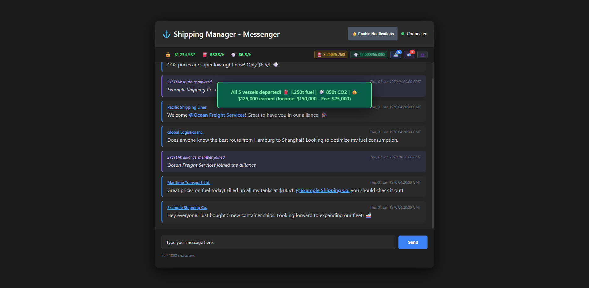
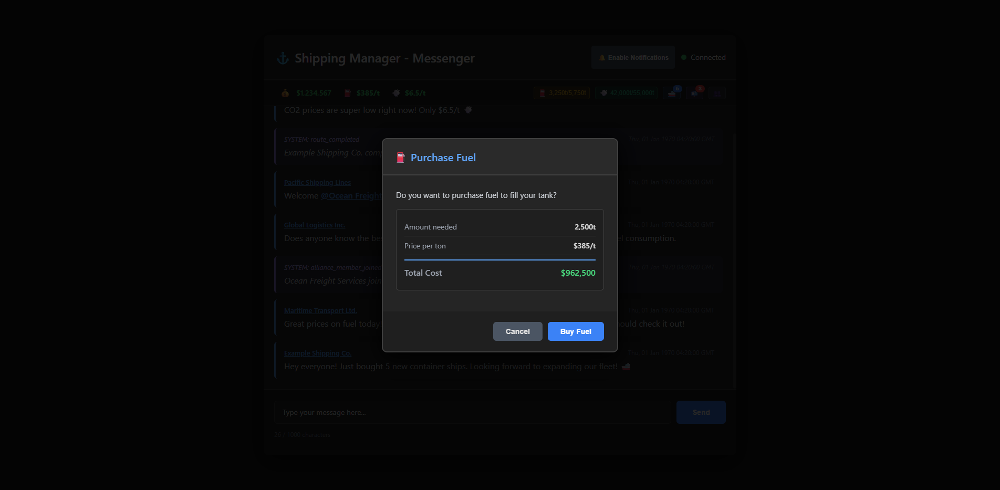
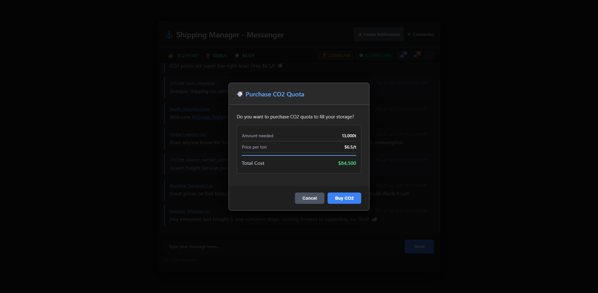
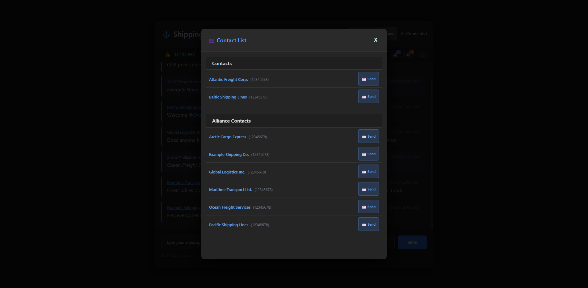
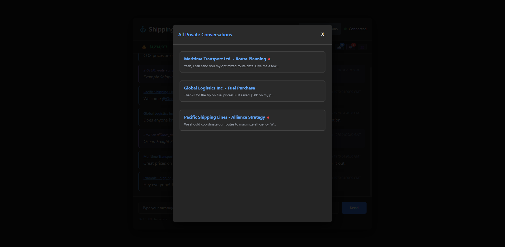
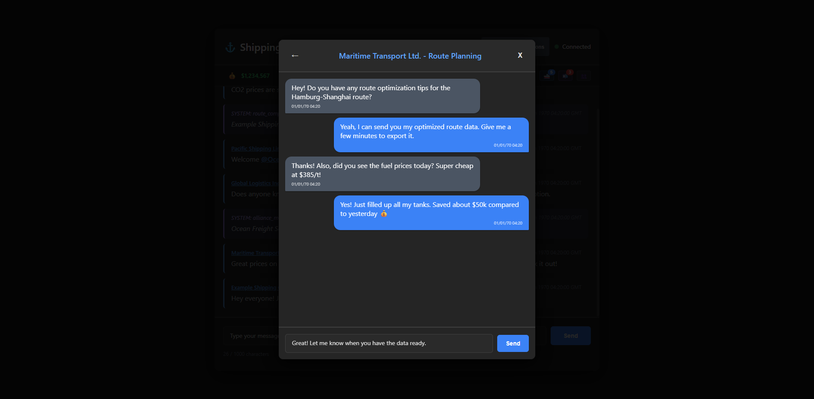

# Shipping Manager - Messenger

## Problem Statement

When playing [Shipping Manager](http://shippingmanager.cc/) on Steam, the in-game chat suffers from a critical page reload bug. Typing certain characters causes the entire game page to refresh, making communication with alliance members nearly impossible. Messages get lost mid-typing, disrupting coordination and team play.

This tool provides a comprehensive standalone web interface that connects directly to the Shipping Manager API, offering alliance chat, private messaging, game management features, and more - all without the game's input bugs.

## Features

### Alliance Chat
- **Real-time Alliance Chat**: WebSocket-based live chat updates with randomized intervals (25-27s) for stealth
- **Member Mentions**: Use `@` to mention alliance members with autocomplete
- **Message History**: View complete chat feed with timestamps
- **Feed Events**: See alliance member joins and route completions
- **No Page Reloads**: Type freely without triggering game bugs
- **Character Counter**: Track message length (1000 char limit)
- **Multi-line Support**: Use Shift+Enter for line breaks
- **No Alliance Support**: Gracefully handles users not in an alliance

### Private Messaging
- **Private Conversations**: Send and receive private messages to/from other players
- **Message Inbox**: View all private conversations with unread count badge
- **Chat Selection**: Choose between multiple conversations with the same user (different subjects)
- **New Messages**: Start new conversations with custom subjects
- **Contact List**: Access all your contacts and alliance members
  - Separate sections for regular contacts and alliance contacts
  - Alphabetically sorted lists
  - Quick "Send Message" buttons

### Game Management
- **Cash Display**: Real-time cash balance with auto-updates
- **Fuel Management**:
  - Current fuel level and capacity display
  - One-click max fuel purchase with price confirmation
  - Price per ton display (turns green when ≤ $400/t)
  - Price alerts when fuel drops below threshold
- **CO2 Management**:
  - Current CO2 quota and capacity display
  - One-click max CO2 purchase with price confirmation
  - Price per ton display (turns green when ≤ $7/t)
  - Price alerts when CO2 drops below threshold
- **Vessel Management**:
  - Real-time count of vessels in harbor
  - One-click "Depart All" with detailed feedback
  - Shows fuel/CO2 consumption and earnings per departure

### Advanced Features
- **Smart Purchase Dialogs**: Detailed confirmation dialogs showing amount, price per ton, and total cost
- **Browser Notifications**: Desktop notifications for new messages and price alerts
- **Debounced API Calls**: Rate-limited requests to avoid detection (800-1000ms delays)
- **Randomized Intervals**: Variable polling times to appear more human-like
- **Extended Feedback**: Success/error messages display for 6 seconds
- **Responsive Design**: Modern dark theme with glassmorphism effects

***

## Legal Disclaimer & Risk Notice

**WARNING: USE OF THIS TOOL IS AT YOUR OWN RISK!**

This tool implements automated procedures to extract session cookies from the local Steam client cache and interacts directly with the game's API (`shippingmanager.cc`).

1.  **Violation of ToS:** These techniques **most likely** violate the Terms of Service (ToS) of both **Steam** and **Shipping Manager**.
2.  **Potential Consequences:** Use of this tool may lead to the **temporary suspension** or **permanent ban** of your Steam or game account.
3.  **No Liability:** The developers of this tool **assume no liability** for any damages or consequences resulting from its use. **Every user is solely responsible for complying with the respective terms of service.**

***

## Requirements

### All Platforms
- **Node.js** 14.0 or higher
- **npm** (Node Package Manager)
- **Python** 3.7+ (with `pip`)
- **Modern web browser** (Chrome/Chromium recommended for Selenium screenshots)
- Active Shipping Manager account on Steam (alliance membership optional)

### Windows (Required for Automated Cookie Extraction)
- **`pywin32`** and **`cryptography`** Python packages (installed in Step 2)
- **`selenium`** Python package (optional, for screenshot generation)

***

## Installation & Setup

### Step 1: Clone or Download
Clone the repository and navigate into the directory:
```bash
git clone [https://github.com/yourusername/shipping-manager-chat.git](https://github.com/yourusername/shipping-manager-chat.git)
cd shipping-manager-chat
```

### Step 2: Install Dependencies (Node.js & Python)
Install all necessary Node.js packages and the Windows-specific Python libraries for DPAPI decryption:
```bash
# Install Node.js packages
npm install

# Install Python packages for Windows decryption
pip install pywin32 cryptography

# Optional: Install Selenium for screenshot generation
pip install selenium
```

### Step 3: Automated Startup (No Manual Cookie Required!) 🚀

This tool uses an automated process to securely extract your current, encrypted Session Cookie directly from the Steam client cache.

#### ❗ Important Note on Initial Login State

The session cookie is **only generated and stored in the Steam cache** if you have **previously logged into the Steam client successfully** and **started the game `Shipping Manager` at least once**.

As long as the token remains valid (typically several weeks to months), you **do not need to repeat the Steam login process**, even if you restart or exit the Steam client.

#### Process Logic

The `run.js` wrapper script intelligently controls the startup process:

1.  **Stop:** The process attempts to terminate the Steam client to release the database lock.
2.  **Extract:** The cookie is retrieved from the unlocked database.
3.  **Start/Restart:**
    * If Steam was **already running** before the start, it will be **restarted** after cookie extraction.
    * If Steam was **not running** before the start, it will be **launched** after cookie extraction.

**Start Command:**
Use the wrapper script `run.js` to manage the entire process:
```bash
# This command executes run.js, which:
# 1. Kills Steam (if running).
# 2. Extracts the Session Cookie using the Python script.
# 3. Starts the app.js server with the fresh cookie in process.env.
# 4. Restarts Steam (if necessary, or launches it if not running).
node run.js
```

The server will be started at `http://localhost:12345`. Open this URL in your browser.

***

## Configuration

The core configuration is located in `app.js`:

```javascript
const PORT = 12345;                              // Server port
const SHIPPING_MANAGER_API = '[https://shippingmanager.cc/api](https://shippingmanager.cc/api)';  // API endpoint
// SESSION_COOKIE is now set automatically via process.env by run.js.
```

***

## Security Notice

**Your Session Cookie is extracted automatically and dynamically!** The manual step of saving the cookie in a `.env` file is no longer required, significantly **improving local security** by preventing the sensitive value from being permanently stored in a file.

**Never share the decrypted cookie publicly!** The cookie provides full, persistent access to your Shipping Manager account.

## License

MIT License - Use at your own risk

## Disclaimer

This tool is not affiliated with Shipping Manager or Steam. It's a community-created workaround for the known chat bug.

***

## Screenshots

### Main View - Alliance Chat


### Success Feedback Message


### Fuel Purchase Dialog


### CO2 Purchase Dialog


### Contact List


### All Private Conversations


### Private Chat Conversation


### Action Bar Details

