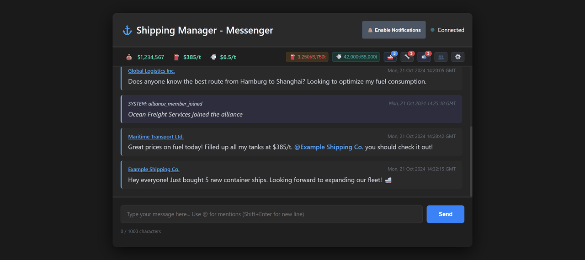

# Shipping Manager - Messenger

## Problem Statement

When playing [Shipping Manager](http://shippingmanager.cc/) on Steam, the in-game chat suffers from a critical page reload bug. Typing certain characters causes the entire game page to refresh, making communication with alliance members nearly impossible. Messages get lost mid-typing, disrupting coordination and team play.

This tool provides a comprehensive standalone web interface that connects directly to the Shipping Manager API, offering alliance chat, private messaging, game management features, and more - all without the game's input bugs :)

## Features

### Alliance Chat
- **Real-time Alliance Chat**: WebSocket-based live chat updates with randomized intervals (25-27s) for stealth
- **Member Mentions**: Use `@` to mention alliance members with autocomplete suggestions
- **Instant Message Display**: See your sent messages immediately in the chat feed
- **Message History**: View complete chat feed with timestamps
- **Feed Events**: See alliance member joins and route completions
- **No Page Reloads**: Type freely without triggering game bugs
- **Character Counter**: Track message length (1000 char limit)
- **Multi-line Support**: Use Shift+Enter for line breaks
- **Click to Chat**: Click on any company name in the chat to start a private conversation
- **No Alliance Support**: Gracefully handles users not in an alliance

### Private Messaging
- **Private Conversations**: Send and receive private messages to/from other players
- **Message Inbox**: View all private conversations with unread count badge
- **Chat Selection**: Choose between multiple conversations with the same user (different subjects)
- **New Messages**: Start new conversations with custom subjects
- **Instant Updates**: Messages appear immediately after sending
- **Contact List**: Access all your contacts and alliance members
  - Separate sections for regular contacts and alliance contacts
  - Alphabetically sorted lists
  - Quick "Send Message" buttons
  - Direct access to start conversations

### Game Management
- **Cash Display**: Real-time cash balance with auto-updates every 30 seconds
- **Fuel Management**:
  - Current fuel level and capacity display
  - One-click max fuel purchase with detailed confirmation dialog
  - Price per ton display (turns green when ≤ $400/t)
  - Configurable price alerts with browser notifications
  - Smart purchase calculations
- **CO2 Management**:
  - Current CO2 quota and capacity display
  - One-click max CO2 purchase with detailed confirmation dialog
  - Price per ton display (turns green when ≤ $7/t)
  - Configurable price alerts with browser notifications
  - Smart purchase calculations
- **Vessel Management**:
  - Real-time count of vessels in harbor
  - One-click "Depart All" with detailed feedback
  - Shows fuel/CO2 consumption and earnings per departure
  - Auto-refresh every 30 seconds
- **Bulk Repair**:
  - Automatic detection of vessels with high wear
  - Configurable wear threshold (10% or 20%)
  - One-click bulk repair with cost preview
  - Real-time badge showing number of vessels needing repair
  - Prevents repair if insufficient funds

### Settings & Customization
- **Price Alert Thresholds**:
  - Customizable fuel price alert threshold (default: $400/ton)
  - Customizable CO2 price alert threshold (default: $7/ton)
  - Browser notification test button
- **Maintenance Settings**:
  - Configurable wear threshold for automatic repair detection
  - Options: 10% or 20% wear threshold
- **Persistent Settings**: All preferences saved in browser localStorage

### Advanced Features
- **Smart Purchase Dialogs**: Detailed confirmation dialogs showing:
  - Amount needed to fill tank/storage
  - Current price per ton
  - Total cost calculation
  - Current cash balance validation
- **Browser Notifications**: Desktop notifications for:
  - Price alerts when fuel/CO2 drops below thresholds
  - Animated price alert with spin effect on page
  - Test notification button in settings
- **HTTPS Support**:
  - Self-signed certificates with automatic generation
  - Network IP addresses included in certificate
  - Accessible from all devices on local network
- **Debounced API Calls**: Rate-limited requests to avoid detection (800-1000ms delays)
- **Randomized Intervals**: Variable polling times to appear more human-like
- **Extended Feedback**: Success/error messages with multi-line support
- **Responsive Design**: Modern dark theme with glassmorphism effects
- **Demo Mode**: Fully functional demo page (`/example.html`) with dummy data

***

## Legal Disclaimer & Risk Notice

**WARNING: USE OF THIS TOOL IS AT YOUR OWN RISK!**

This tool implements automated procedures to extract session cookies from the local Steam client cache and interacts directly with the game's API (`shippingmanager.cc`).

1.  **Violation of ToS:** These techniques **most likely** violate the Terms of Service (ToS) of both **Steam** and **Shipping Manager**.
2.  **Potential Consequences:** Use of this tool may lead to the **temporary suspension** or **permanent ban** of your Steam or game account.
3.  **No Liability:** The developers of this tool **assume no liability** for any damages or consequences resulting from its use. **Every user is solely responsible for complying with the respective terms of service.**

***

## Requirements

### All Platforms
- **Node.js** 22.0 or higher (required for native TLS certificate generation)
- **npm** (Node Package Manager)
- **Python** 3.7+ (with `pip`)
- **Modern web browser** (Chrome/Chromium recommended)
- Active Shipping Manager account on Steam (alliance membership optional)

### Windows (Required for Automated Cookie Extraction)
- **`pywin32`** and **`cryptography`** Python packages (installed in Step 2)
- **`selenium`**, **`opencv-python`**, **`pillow`** (optional, for demo video/screenshot generation)

***

## Installation & Setup

### Step 1: Clone or Download
Clone the repository and navigate into the directory:
```bash
git clone https://github.com/yourusername/shipping-manager-messenger.git
cd shipping-manager-messenger
```

### Step 2: Install Dependencies (Node.js & Python)
Install all necessary Node.js packages and the Windows-specific Python libraries for DPAPI decryption:
```bash
# Install Node.js packages
npm install

# Install Python packages for Windows decryption
pip install pywin32 cryptography

# Optional: Install packages for demo recording
pip install selenium opencv-python pillow
```

### Step 3: Automated Startup (No Manual Cookie Required!) 🚀

This tool uses an automated process to securely extract your current, encrypted Session Cookie directly from the Steam client cache.

#### ❗ Important Note on Initial Login State

The session cookie is **only generated and stored in the Steam cache** if you have **previously logged into the Steam client successfully** and **started the game `Shipping Manager` at least once**.

As long as the token remains valid (typically several weeks to months), you **do not need to repeat the Steam login process**, even if you restart or exit the Steam client.

#### Process Logic

The `run.js` wrapper script intelligently controls the startup process:

1.  **Stop:** The process attempts to terminate the Steam client to release the database lock.
2.  **Extract:** The cookie is retrieved from the unlocked database.
3.  **Start/Restart:**
    * If Steam was **already running** before the start, it will be **restarted** after cookie extraction.
    * If Steam was **not running** before the start, it will be **launched** after cookie extraction.

**Start Command:**
Use the wrapper script `run.js` to manage the entire process:
```bash
# This command executes run.js, which:
# 1. Kills Steam (if running).
# 2. Extracts the Session Cookie using the Python script.
# 3. Starts the app.js server with the fresh cookie in process.env.
# 4. Restarts Steam (if necessary, or launches it if not running).
node run.js
```

The server will be started at `https://localhost:12345`. Open this URL in your browser and accept the self-signed certificate warning.

***

## Configuration

The core configuration is located in `server/config.js`:

```javascript
module.exports = {
  PORT: 12345,
  HOST: '0.0.0.0',  // Listens on all network interfaces
  SHIPPING_MANAGER_API: 'https://shippingmanager.cc/api',
  SESSION_COOKIE: process.env.SHIPPING_MANAGER_COOKIE,  // Auto-injected by run.js

  // Rate limiting
  RATE_LIMIT: {
    windowMs: 15 * 60 * 1000,  // 15 minutes
    max: 1000
  },

  // Chat auto-refresh interval
  CHAT_REFRESH_INTERVAL: 25000  // 25 seconds
};
```

### Settings (In-App)

Access settings via the ⚙️ button in the header:

- **Fuel Alert Threshold**: Set custom price threshold for fuel alerts (default: $400/ton)
- **CO2 Alert Threshold**: Set custom price threshold for CO2 alerts (default: $7/ton)
- **Maintenance Threshold**: Set wear percentage for automatic repair detection (10% or 20%)
- **Test Notifications**: Test browser notifications before enabling alerts

***

## Network Access

The application uses HTTPS with self-signed certificates that include all your local network IP addresses. This allows you to access the application from any device on your local network:

1. Start the server with `node run.js`
2. Note the network URLs displayed in the console (e.g., `https://192.168.1.100:12345`)
3. On another device, navigate to that URL
4. Accept the self-signed certificate warning
5. The app is now accessible across your local network

***

## Security Notice

**Your Session Cookie is extracted automatically and dynamically!** The manual step of saving the cookie in a `.env` file is no longer required, significantly **improving local security** by preventing the sensitive value from being permanently stored in a file.

**Never share the decrypted cookie publicly!** The cookie provides full, persistent access to your Shipping Manager account.

**Security Features:**
- Session cookie only stored in memory (process.env)
- HTTPS with self-signed certificates
- Input validation on all endpoints
- Rate limiting on API calls
- Helmet middleware for security headers

***

## Project Structure

```
shippingmanager_messanger/
├── app.js                    # Main application entry point
├── run.js                    # Startup wrapper (handles Steam & cookie extraction)
├── server/
│   ├── config.js            # Centralized configuration
│   ├── certificate.js       # HTTPS certificate generation
│   ├── middleware/          # Express middleware
│   ├── routes/              # API routes (alliance, messenger, game)
│   ├── utils/               # Helper functions (API calls, caching)
│   └── websocket.js         # WebSocket server for real-time updates
├── helper/
│   └── get-session-from-steam-windows11.py  # Cookie extraction script
├── public/
│   ├── index.html           # Main application UI
│   ├── css/style.css        # Styling
│   └── js/
│       └── script.js        # Main application logic
└── screenshots/             # Screenshots for documentation
        └── demo.gif         # Demo Example
```

***

## Troubleshooting

### Certificate Warnings
The self-signed certificate will trigger browser warnings. This is expected and safe for local network use. Click "Advanced" → "Proceed to localhost" (or similar).

### Steam Not Restarting
If Steam doesn't restart automatically, check:
- Steam installation path matches default (`C:\Program Files (x86)\Steam\steam.exe`)
- You have permissions to start Steam

### Session Cookie Expired
If you get authentication errors:
1. Stop the server
2. Log into Shipping Manager via Steam
3. Restart the server with `node run.js`

### Network Access Issues
If you can't access from other devices:
1. Check your firewall allows connections on port 12345
2. Verify you're using the correct network IP address
3. Regenerate certificates: delete `cert.pem` and `key.pem`, then restart

***

## License

MIT License - Use at your own risk

## Disclaimer

This tool is not affiliated with Shipping Manager or Steam. It's a community-created workaround for the known chat bug.

***

## Demo



A fully functional demo is available at `https://localhost:12345/example.html` after starting the server.
